# 🤖 Autonomous IT Support Agent


> **An agentic workflow that automates Tier-1 support tickets. Uses Local LLMs (Llama 3) and RAG to research solutions, draft responses, and route low-confidence issues to humans.**

---

## 🏗️ Architecture

This system uses a **Multi-Agent** approach orchestrated by **LangGraph**. A Supervisor node routes tickets to specialized workers, ensuring accuracy via a Quality Gate.

```mermaid
graph TD
    User("User Submission") --> API("FastAPI Endpoint")
    API --> Triage["🕵️ Triage Agent"]
    Triage --> Research["📚 Research Agent (RAG)"]
    Research --> Draft["✍️ Drafter Agent"]
    Draft --> Quality{"⚖️ Quality Gate"}
    
    Quality -->|Confidence > 0.8| Resolved("✅ Auto-Resolve")
    Quality -->|Confidence < 0.8| Human("👨‍💻 Human Review")
    
    subgraph "Human-in-the-Loop"
    Human --> Dashboard["Streamlit Mission Control"]
    Dashboard --> API
    end
```



## ✨ Features

-   **🧠 RAG Engine**: Retrieves technical documentation from a local Vector Store (**ChromaDB**) to ground LLM responses (No hallucinations!).
-   **🤝 Human-in-the-Loop**: A dedicated **Streamlit Dashboard** for IT Operators to review, edit, and approve low-confidence ticket drafts.
-   **🐳 Fully Containerized**: One command spins up the API, Dashboard, and PostgreSQL database.
-   **🔒 Privacy First**: Runs entirely with Local LLMs (**Ollama**) — no data leaves your infrastructure.
-   **🔭 Observable**: Integrated with **LangSmith** for full trace visualization and debugging.

---

## 🚀 Quick Start

### Prerequisites
-   [Docker Desktop](https://www.docker.com/products/docker-desktop/) installed.
-   [Ollama](https://ollama.com/) running locally with `llama3` pulled.

### 1. Clone & Configure
```bash
git clone https://github.com/yourusername/auto-it-support.git
cd auto-it-support

# Create environment file
cp .env.example .env
```

### 2. Run with Docker
Start the entire stack (Backend + Frontend + DB):
```bash
docker-compose up --build
```

### 3. Access the System
-   **Mission Control Dashboard:** [http://localhost:8501](http://localhost:8501)
-   **API Documentation:** [http://localhost:8000/docs](http://localhost:8000/docs)

---

## 🛠️ Development Setup (Local)

If you prefer running without Docker for development:

```bash
# Install dependencies
pip install -r requirements.txt

# Start Backend
./run.sh

# Start Dashboard (New Terminal)
streamlit run dashboard/app.py
```

## 🧪 Testing

We include a health check script to verify all connections (DB, LLM, Vector Store):

```bash
python scripts/health_check.py
```

---

## 📜 License

Distributed under the MIT License. See `LICENSE` for more information.
